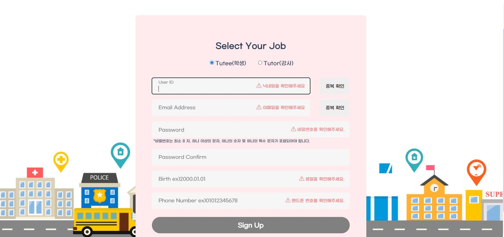

## 📝 시연 시나리오

배포 주소 :  https://k5c202.p.ssafy.io/

#### 1. 홈 화면

- 서비스 소개

#### 2. 회원가입

- 유효성 검사 ( + 아이디, 이메일 중복체크)

#### 3. 로그인 후 유니티로 입장

- 유니티로 입장하기

#### 4. 유니티 입장

- 입장 전 웹캠설정

#### 5. 메인페이지

- 카테고리 선택 씬

#### 6. 강의실 입장

- 복도 입장

- 해당 강의실 입장 전 암호 입력

- 강의실 입장

#### 7. 웹캠 활용한 강의

- 책상에서 R키를 눌러 해당 강의실 수강생 웹캠 입장

- 화면공유 및 채팅기능

#### 8.마이페이지

- 본인 정보 확인

- 캐릭터 선택

  

#### 9. 라운지

- 채팅 기능 및 게임 기능

